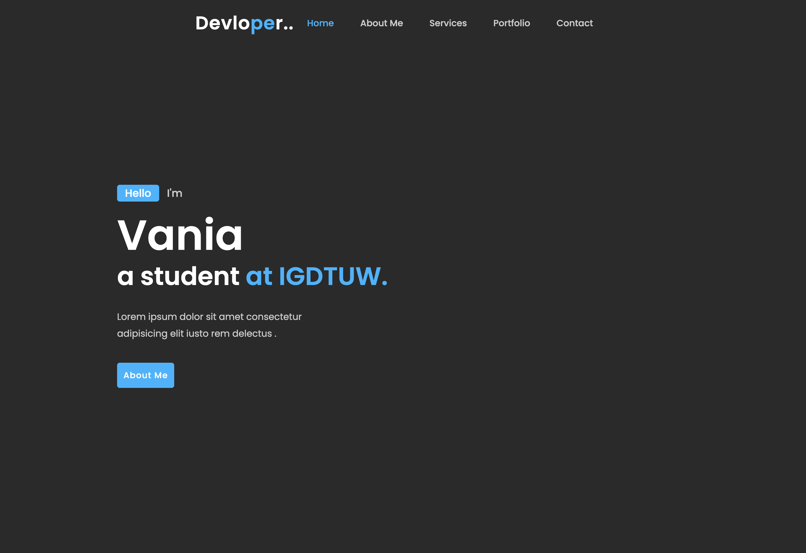
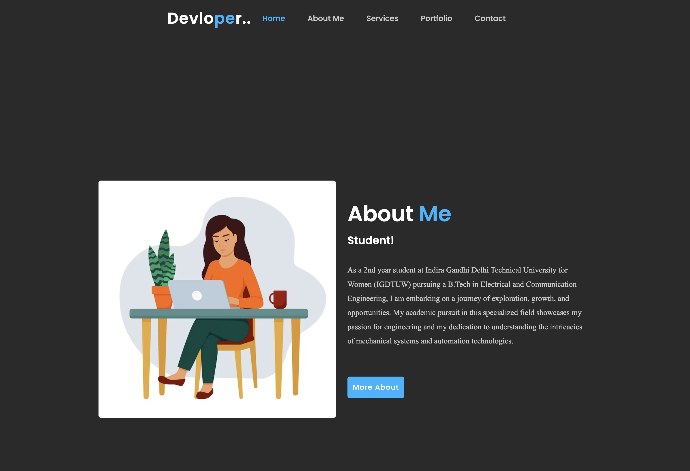
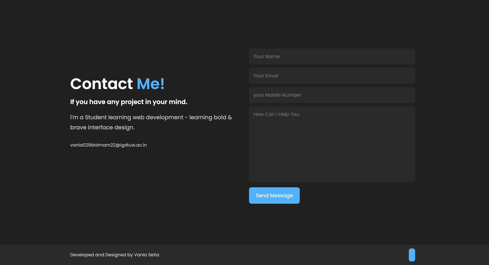

# Portfolio

This is a simple portfolio I created using React!

## Installation

Use the package manager [npm](https://www.npmjs.com/) to install the dependencies.

```bash
npm install
```

## Usage

The following command will spin up a local instance of the app.

```bash
npm start
```

You can also build the app for production using the following command.

```bash
npm run build
```

The built app can then be served using the following command.

```bash
serve -s build
```

## Screenshots


